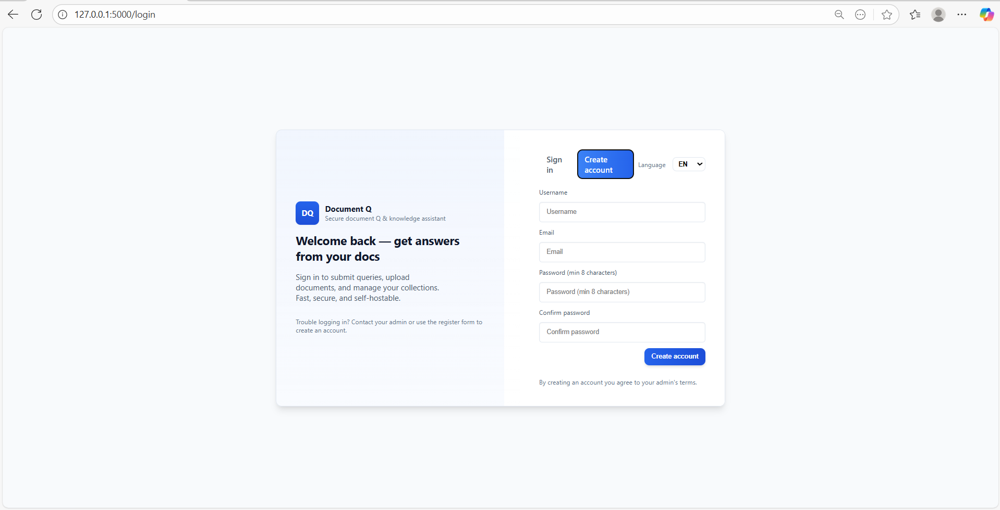
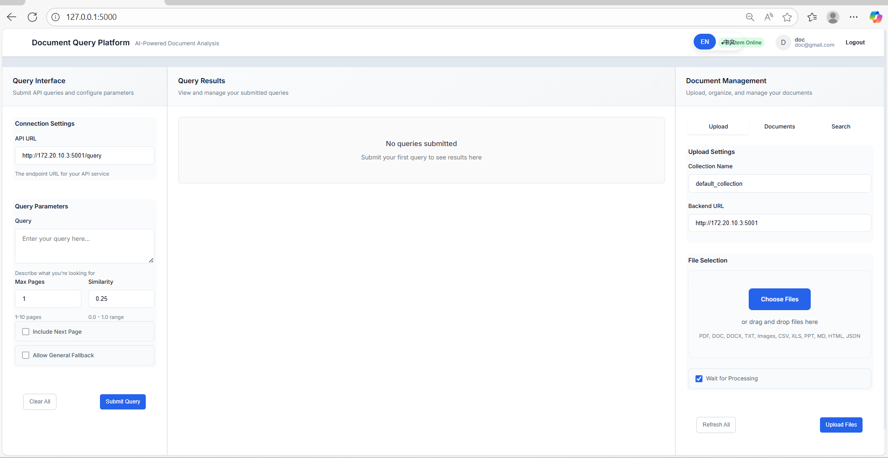

# colivara-autodeploy

**Automated deployment wrapper for ColiVara with extended API features and testing interface**

---

 



## 📖 About

**colivara-autodeploy** is an automated deployment solution that simplifies the setup of the powerful [ColiVara](https://github.com/tjmlabs/ColiVara) RAG system with a single command, while extending it with enhanced query capabilities and a testing interface.

### 🙏 Credits

This project is built upon the excellent work by **TJM Labs**:

- **[ColiVara](https://github.com/tjmlabs/ColiVara)** - Core document RAG framework and REST API
- **[ColiVarE](https://github.com/tjmlabs/ColiVarE)** - Embedding service powered by ColQwen2

**All credit for the core RAG functionality belongs to the original authors.**

### 🎯 What This Repository Adds

This repository simplifies deployment and extends functionality:

| Feature | Port | Description |
|---------|------|-------------|
| **🚀 One-Command Setup** | - | Automated script installs everything from scratch |
| **🔧 Extended Query API** | 5001 | Enhanced API with advanced document querying, multi-page context, diagram generation, and fuzzy search |
| **🧪 Testing Web App** | 5000 | Interactive interface for testing queries and document uploads |
| **📦 Complete Integration** | - | Pre-configured systemd services with health monitoring |
| **🐍 Auto Python Setup** | - | Automatically installs Python 3.10 if not present |
| **🤖 Ollama Integration** | 11434 | Automatic Ollama setup with Qwen2.5-VL model |
| **📥 Model Management** | - | Auto-downloads ColQwen2 model from Hugging Face |

---

## ✨ Extended Query API Features (Port 5001)

The enhanced Query API on **port 5001** extends ColiVara with:

### Advanced Document Querying
- **Multi-Document Context**: Retrieves and analyzes pages from multiple documents simultaneously
- **Fuzzy Query Expansion**: Automatically expands queries with related terms for better search coverage
- **Similarity Threshold Filtering**: Configurable score thresholds for result quality
- **Next Page Inclusion**: Option to include adjacent pages for better context
- **General Knowledge Fallback**: Falls back to LLM general knowledge when documents don't match

### Visual Processing
- **Vision-Language Model Integration**: Uses Ollama with Qwen2.5-VL for visual document understanding
- **Multi-Page Image Processing**: Processes multiple document pages as images
- **Base64 Image Handling**: Direct image data in responses for frontend display

### Intelligent Diagram Generation
- **Automatic Diagram Detection**: AI determines when diagrams would be helpful
- **Mermaid Syntax Generation**: Creates flowcharts, sequence diagrams, and more from document content
- **MCP Integration**: Uses Model Context Protocol for enhanced diagram rendering
- **Document-Based Diagrams**: Generates diagrams from actual document images

### Document Management
- **Upload Single/Bulk**: Upload individual files or entire folders
- **Duplicate Detection**: Prevents re-uploading existing documents
- **Comprehensive Metadata**: Tracks upload time, file size, source, and more
- **Smart Search**: Partial match and case-insensitive document search
- **Bulk Delete**: Delete multiple documents by keyword matching
- **Document Preview**: Preview pages with actual images

### Enhanced Features
- **Table Detection & Parsing**: Automatically extracts and formats tables from documents
- **Section Boosting**: Boosts relevance of key document sections
- **Debug Information**: Detailed processing logs for transparency
- **Source Tracking**: Complete document and page attribution

---

## 🏗️ Architecture

### Service Overview

| Service | Port | Source | Description |
|---------|------|--------|-------------|
| **Embedding Service** | 8000 | ColiVarE | ColQwen2 embedding generation |
| **ColiVara API** | 8001 | ColiVara | Core document management REST API |
| **MinIO Console** | 9001 | ColiVara | S3-compatible storage interface |
| **Ollama** | 11434 | Auto-installed | Local LLM inference (Qwen2.5-VL) |
| **Query API** ⭐ | 5001 | **This Repo** | Extended query processing with VLM & diagrams |
| **Web App** ⭐ | 5000 | **This Repo** | Testing and demo interface |

⭐ = Extended features added by this repository

### Data Flow

```
User Query → Query API (5001)
              ↓
    ┌─────────┴─────────────────┐
    ↓                           ↓
ColiVara Search API (8001)   Ollama VLM (11434)
    ↓                           ↓
Embedding Service (8000)    Document Images
    ↓                           ↓
  Document Retrieval ←→ Visual Analysis
              ↓
      Combined Response
      (Text + Images + Diagrams)
```

---

## 🚀 Quick Start

### Prerequisites

**Required:**
- Linux OS (Ubuntu 20.04+, Debian, RHEL, CentOS, Fedora, Arch)
- Docker & Docker Compose
- Git
- 8GB+ RAM (16GB+ recommended)
- 50GB+ free disk space

**Auto-Installed:**
- Python 3.10
- Ollama
- All Python dependencies

### Installation

**One command deploys everything:**

```bash
# Clone this repository
git clone https://github.com/takuphilchan/colivara-autodeploy.git
cd colivara-autodeploy

# Run the setup script
chmod +x setup_colivara.sh
./setup_colivara.sh
```

The script automatically:
1. ✅ Installs Python 3.10 if missing
2. ✅ Clones ColiVara and ColiVarE repositories
3. ✅ Downloads ColQwen2 model from Hugging Face
4. ✅ Installs and configures Ollama
5. ✅ Pulls Qwen2.5-VL model
6. ✅ Sets up 4 systemd services
7. ✅ Configures health monitoring
8. ✅ Starts all services

**Setup time:** 15-30 minutes (depends on internet speed)

---

## 📁 Project Structure

```
colivara-autodeploy/
├── setup_colivara.sh      # Automated installation script
├── api.py                 # Extended Query API (Port 5001)
├── app.py                 # Testing web interface (Port 5000)
├── templates/             # HTML templates for web app
├── logs/                  # Service logs (auto-created)
├── ColiVara/             # Core ColiVara API (auto-cloned)
├── ColiVarE/             # Embedding service (auto-cloned)
└── README.md             # This file
```

---

## 🎮 Usage

### Access the Services

After installation:

```bash
# Extended Query API (This Repo)
http://your-server:5001

# Testing Web Interface (This Repo)
http://your-server:5000

# ColiVara API Documentation (Original)
http://your-server:8001/v1/docs

# MinIO Console (Original)
http://your-server:9001
```

### Default Credentials

**Admin Account:**
- Username: `admin`
- Password: `admin123`
- ⚠️ **Change immediately in production!**

**MinIO:**
- Access Key: `miniokey`
- Secret Key: `miniosecret`

### API Examples

#### Extended Query API (Port 5001)

**Basic Query:**
```bash
curl -X POST "http://localhost:5001/query" \
  -H "Content-Type: application/json" \
  -d '{
    "api_key": "your_api_key",
    "query": "What are the requirements for establishing a sole proprietorship?",
    "similarity_threshold": 0.25
  }'
```

**Query with Next Page Context:**
```bash
curl -X POST "http://localhost:5001/query" \
  -H "Content-Type: application/json" \
  -d '{
    "api_key": "your_api_key",
    "query": "Explain the process flow",
    "include_next_page": true,
    "max_additional_pages": 2,
    "similarity_threshold": 0.25
  }'
```

**Query with Diagram Generation:**
```bash
curl -X POST "http://localhost:5001/query" \
  -H "Content-Type: application/json" \
  -d '{
    "api_key": "your_api_key",
    "query": "Show me the workflow diagram",
    "include_next_page": true,
    "allow_general_fallback": true
  }'
```

**Upload Document:**
```bash
curl -X POST "http://localhost:5001/upload" \
  -F "file=@document.pdf" \
  -F "api_key=your_api_key" \
  -F "collection_name=default_collection"
```

**Bulk Upload from Folder:**
```bash
curl -X POST "http://localhost:5001/upload-bulk" \
  -F "folder_path=/path/to/documents" \
  -F "api_key=your_api_key" \
  -F "collection_name=default_collection" \
  -F "max_concurrent=3"
```

**Search Documents:**
```bash
curl "http://localhost:5001/search-documents?query=invoice&api_key=your_api_key"
```

**List All Documents:**
```bash
curl "http://localhost:5001/documents?api_key=your_api_key&collection_name=default_collection"
```

**Preview Document:**
```bash
curl "http://localhost:5001/preview/document.pdf?api_key=your_api_key&page_number=1&max_pages=3"
```

**Delete Document:**
```bash
curl -X DELETE "http://localhost:5001/delete/document.pdf?api_key=your_api_key"
```

**Bulk Delete by Keyword:**
```bash
curl -X DELETE "http://localhost:5001/delete-matching?keyword=_draft&api_key=your_api_key"
```

**Health Check:**
```bash
curl "http://localhost:5001/health"
```

#### Original ColiVara API (Port 8001)

**Search Documents:**
```bash
curl -X POST "http://localhost:8001/v1/search" \
  -H "Authorization: Bearer YOUR_TOKEN" \
  -H "Content-Type: application/json" \
  -d '{
    "query": "financial report",
    "collection_name": "my_docs",
    "top_k": 5
  }'
```

---

## ⚙️ Configuration

### Environment Variables

Customize before running setup:

```bash
# Service Ports
export EMBEDDING_PORT=8000        # ColiVarE embedding service
export COLIVARA_API_PORT=8001     # Core ColiVara API
export APP_PORT=5000              # Testing web interface
export QUERY_API_PORT=5001        # Extended query API
export MINIO_PORT=9001            # MinIO console
export OLLAMA_PORT=11434          # Ollama service

# Storage
export MINIO_ROOT_USER=miniokey
export MINIO_ROOT_PASSWORD=miniosecret
export BUCKET_NAME=colivara

# Models
export OLLAMA_MODEL=qwen2.5-vl:32b
export TORCH_INDEX_URL=https://download.pytorch.org/whl/cu118

# Run setup
./setup_colivara.sh
```

---

## 🔧 Service Management

```bash
# View all services
systemctl status 'colivara-*'

# Individual service control
sudo systemctl start colivara-embedding.service
sudo systemctl stop colivara-api.service
sudo systemctl restart colivara-query-api.service
sudo systemctl restart colivara-app.service

# View logs
journalctl -u colivara-query-api.service -f
tail -f logs/query-api.log
tail -f logs/app.log

# Health checks
curl http://localhost:5001/health
curl http://localhost:8000/health
curl http://localhost:8001/v1/docs
```

---

## 🔄 Troubleshooting

### Services Won't Start

```bash
# Check status
sudo systemctl status colivara-query-api.service

# View logs
journalctl -u colivara-query-api.service -n 100
cat logs/query-api.log
```

### Port Conflicts

```bash
# Reset everything
./setup_colivara.sh --reset

# Check port usage
sudo lsof -i :5001
sudo lsof -i :8000
```

### Model Download Issues

```bash
# Check disk space
df -h

# Manual model download
cd ColiVarE
source .venv/bin/activate
python -c "from huggingface_hub import snapshot_download; \
           snapshot_download('vidore/colqwen2-v1.0', \
           local_dir='models_hub/vidore/colqwen2-v1.0')"
```

### Query API Issues

```bash
# Check if Ollama is running
curl http://localhost:11434/api/tags

# Restart Ollama
sudo systemctl restart ollama

# Check ColiVara connection
curl http://localhost:8001/v1/docs
```

---

## 📊 Hardware Recommendations

| Component | Minimum | Recommended | Optimal |
|-----------|---------|-------------|---------|
| **CPU** | 4 cores | 8 cores | 16+ cores |
| **RAM** | 8GB | 16GB | 32GB+ |
| **GPU** | None | 8GB VRAM | 16GB+ VRAM |
| **Storage** | 50GB | 100GB SSD | 500GB+ NVMe |

### Performance Expectations

- Document Processing: 1-5 seconds per page
- Query Latency: 2-5 seconds (with VLM)
- Diagram Generation: 3-8 seconds
- Concurrent Users: 10-50 (hardware dependent)

---

## 🛡️ Production Checklist

- [ ] Change default admin password
- [ ] Update MinIO credentials  
- [ ] Configure HTTPS reverse proxy
- [ ] Set up firewall rules
- [ ] Enable automatic backups
- [ ] Configure monitoring
- [ ] Set up log aggregation
- [ ] Review security settings
- [ ] Update API keys

---

## 🤝 Contributing

Contributions welcome! Please:

1. Fork the repository
2. Create a feature branch
3. Commit your changes
4. Push to the branch
5. Open a Pull Request

---

## 📝 License

MIT License - see [LICENSE](LICENSE) file

---

## 🙏 Acknowledgments

### Core Projects
- **[ColiVara](https://github.com/tjmlabs/ColiVara)** by TJM Labs - Core RAG framework
- **[ColiVarE](https://github.com/tjmlabs/ColiVarE)** by TJM Labs - Embedding service
- **[ColPali](https://github.com/illuin-tech/colpali)** - Vision language model
- **[Ollama](https://ollama.ai/)** - Local LLM inference

### What We Added
- **Automated deployment script** - One-command setup
- **Extended Query API (port 5001)** - Advanced querying with:
  - Multi-document context retrieval
  - Vision-language model integration
  - Intelligent diagram generation
  - Fuzzy query expansion
  - Table detection and parsing
  - Document preview with images
  - Bulk upload and management
- **Testing web interface (port 5000)** - Interactive UI
- **Production systemd services** - Health monitoring and auto-restart
- **Comprehensive documentation** - Setup guides and API examples

---

## 📞 Support

- **Issues**: [GitHub Issues](https://github.com/your-username/colivara-autodeploy/issues)
- **Original ColiVara**: [ColiVara Repo](https://github.com/tjmlabs/ColiVara)
- **Discussions**: [GitHub Discussions](https://github.com/your-username/colivara-autodeploy/discussions)

---

## 🗺️ Roadmap

- [ ] Enhanced diagram types (Gantt, ER diagrams)
- [ ] Multi-language document support
- [ ] Advanced analytics dashboard
- [ ] Kubernetes deployment manifests
- [ ] Docker Compose simplified deployment
- [ ] Cloud deployment guides (AWS, GCP, Azure)
- [ ] Batch processing improvements
- [ ] Real-time collaboration features

---

**Built to simplify ColiVara deployment and extend its capabilities**

Based on the excellent [ColiVara](https://github.com/tjmlabs/ColiVara) framework by TJM Labs