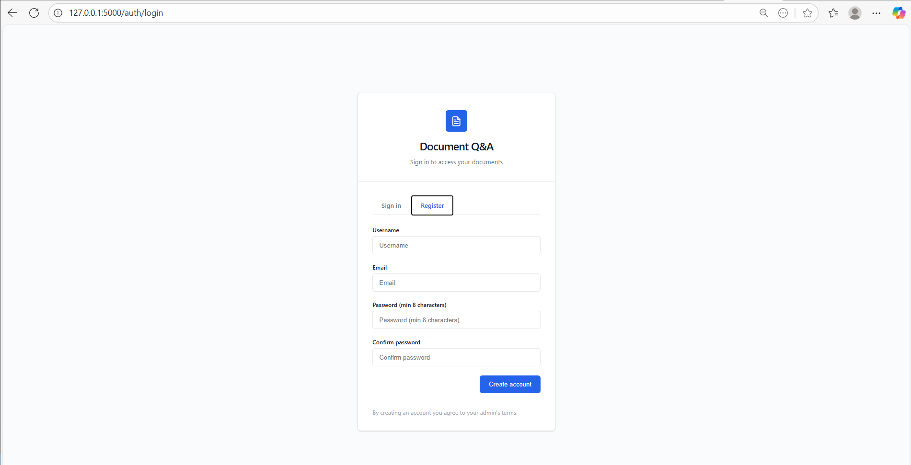
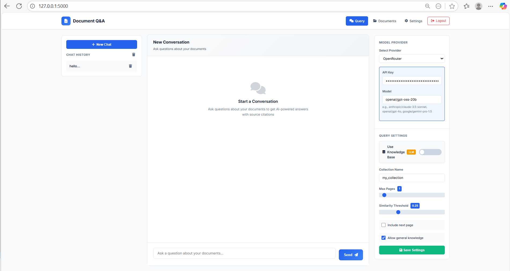
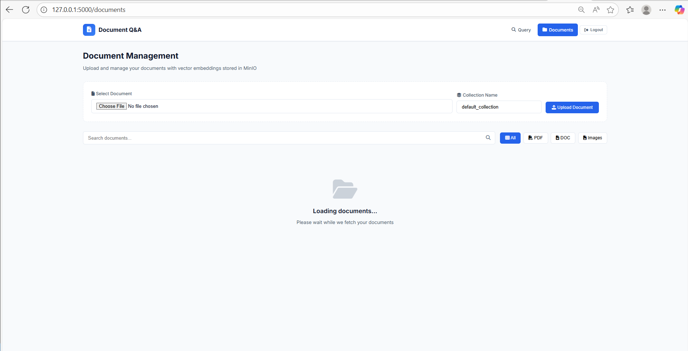

# 📚 ColiVara Document Q&A System

**An intelligent document question-answering system with RAG (Retrieval-Augmented Generation) capabilities**

[Features](#-features) • [Installation](#-installation) • [Usage](#-usage) • [Architecture](#-architecture) • [Screenshots](#-screenshots) • [Credits](#-credits)

---

## 🎯 Overview

ColiVara Document Q&A is a production-ready RAG (Retrieval-Augmented Generation) system that enables intelligent conversations with your documents. Built on top of the powerful [ColiVara](https://github.com/tjmlabs/ColiVara) framework, it provides a complete web interface with user authentication, document management, and multi-provider LLM support.

### ✨ Key Highlights

- 🔍 **Visual Document Understanding** - Powered by ColQwen2 vision models for accurate document comprehension
- 🤖 **Multi-Provider LLM Support** - Works with Ollama (local), OpenAI, Anthropic, and OpenRouter
- 🎚️ **RAG/Pure LLM Toggle** - Switch between document-grounded and general knowledge responses
- 📁 **Document Management** - Upload, view, search, and delete documents with ease
- 🔐 **User Authentication** - Secure login system with session management
- 🎨 **Modern UI** - Clean, responsive interface with dark mode support
- 🚀 **One-Command Setup** - Automated installation script for complete deployment

---

## 📸 Screenshots

### Login Page

*Secure authentication system with clean, modern design*

### Main Query Interface

*Interactive chat interface with RAG/LLM toggle, provider selection, and query settings*

### Documents Management

*Upload, search, filter, and manage your document collection*

---

## 🚀 Features

### Document Processing
- ✅ Multi-format support (PDF, DOC, DOCX, TXT, images)
- ✅ Visual document understanding with ColQwen2
- ✅ Page-level vector embeddings
- ✅ Smart pagination and context retrieval
- ✅ Source citation with similarity scores

### Query Capabilities
- ✅ **RAG Mode**: Document-grounded answers with source citations
- ✅ **Pure LLM Mode**: General knowledge responses without documents
- ✅ Adjustable similarity thresholds
- ✅ Multi-page context retrieval
- ✅ General knowledge fallback option

### LLM Provider Support
- 🦙 **Ollama** - Local LLM (qwen2.5vl:32b default)
- 🤖 **OpenAI** - GPT-4o, GPT-4o-mini, GPT-4-turbo
- 🧠 **Anthropic** - Claude 3 Opus, Sonnet, Haiku
- 🌐 **OpenRouter** - Access to multiple models (Claude 3.5, GPT-4o, Gemini)

### User Interface
- 📱 Responsive design (desktop, tablet, mobile)
- 💬 Chat history management
- ⚙️ Real-time settings adjustment
- 🔔 Toast notifications for feedback
- 🎨 Clean, modern Material Design

---

## 🏗️ Architecture

### Multi-Service Architecture

\`\`\`
┌─────────────────────────────────────────────────────────────┐
│                     User Interface (Port 5000)              │
│                    Flask Web Application                     │
└─────────────────┬───────────────────────────────────────────┘
                  │
                  ▼
┌─────────────────────────────────────────────────────────────┐
│                  API Server (Port 5001)                      │
│                FastAPI Business Logic                        │
└─────────────────┬───────────────────────────────────────────┘
                  │
        ┌─────────┼─────────┬──────────────┐
        ▼         ▼         ▼              ▼
┌──────────┐ ┌─────────┐ ┌─────────┐ ┌──────────┐
│ ColiVara │ │Embedding│ │  MinIO  │ │PostgreSQL│
│   RAG    │ │ Service │ │  S3     │ │ pgvector │
│  :8001   │ │  :8000  │ │  :9000  │ │  :5432   │
└──────────┘ └─────────┘ └─────────┘ └──────────┘
\`\`\`

### Technology Stack

| Component | Technology | Purpose |
|-----------|------------|---------|
| **Frontend** | HTML, CSS, JavaScript | User interface |
| **Web Server** | Flask 3.0 | Authentication, routing |
| **API Server** | FastAPI 0.104 | Business logic, query processing |
| **RAG Engine** | ColiVara | Document retrieval, vector search |
| **Embeddings** | ColQwen2 | Visual document understanding |
| **Vector DB** | PostgreSQL + pgvector | Vector storage |
| **Object Storage** | MinIO | Document storage |
| **LLM Runtime** | Ollama | Local LLM inference |

---

## 📋 Prerequisites

- **OS**: Linux (Ubuntu 20.04+ recommended)
- **RAM**: 16GB minimum (32GB recommended for large models)
- **Disk**: 50GB free space
- **GPU**: NVIDIA GPU with 8GB+ VRAM (optional, improves performance)
- **Python**: 3.10+ (auto-installed if missing)
- **Docker**: Required for ColiVara services

---

## 🛠️ Installation

### Quick Start (Automated)

\`\`\`bash
# Clone the repository
git clone https://github.com/yourusername/colivara-autodeploy.git
cd colivara-autodeploy

# Run the automated setup script
chmod +x setup_colivara.sh
./setup_colivara.sh
\`\`\`

The setup script will:
1. ✅ Check/install Python 3.10
2. ✅ Install system dependencies
3. ✅ Set up Python virtual environment
4. ✅ Install Python packages
5. ✅ Install and configure Ollama
6. ✅ Download ColQwen2 model
7. ✅ Set up ColiVara services (Docker)
8. ✅ Configure environment variables
9. ✅ Initialize databases
10. ✅ Start all services

---

## 🎮 Usage

### Starting the Application

\`\`\`bash
# Activate virtual environment
source venv/bin/activate

# Start web app (Terminal 1)
python app.py

# Start API server (Terminal 2)
python api_server.py
\`\`\`

### Accessing the Application

1. **Open your browser** and navigate to: \`http://localhost:5000\`
2. **Register** a new account or **login** with existing credentials
3. **Upload documents** via the Documents page
4. **Ask questions** about your documents on the Query page

### Using the Query Interface

#### RAG Mode (Default)
1. Toggle **"Use Knowledge Base"** ON (blue badge shows "RAG")
2. Upload documents via the Documents page
3. Enter your question and select LLM provider
4. Get answers with source citations

#### Pure LLM Mode
1. Toggle **"Use Knowledge Base"** OFF (orange badge shows "LLM")
2. Enter your question
3. Get general knowledge responses without document context

### Configuration Options

#### Query Settings
- **Collection Name**: Document collection to query (default: \`my_collection\`)
- **Max Pages**: Number of document pages to retrieve (1-10)
- **Similarity Threshold**: Minimum similarity score (0.0-1.0)
- **Include Next Page**: Automatically include following pages
- **Allow General Knowledge**: Fallback to LLM when no documents match

#### Provider Settings

**Ollama (Local)**
- URL: \`http://localhost:11434\`
- Model: \`qwen2.5vl:32b\`

**OpenAI**
- API Key: Your OpenAI API key
- Model: gpt-4o, gpt-4o-mini, gpt-4-turbo

**OpenRouter**
- API Key: Your OpenRouter API key
- Model: anthropic/claude-3.5-sonnet, openai/gpt-4o, etc.

**Anthropic**
- API Key: Your Anthropic API key
- Model: claude-3-opus, claude-3-sonnet, claude-3-haiku

---

## 🔧 Configuration

### Environment Variables

Create a \`.env\` file in the root directory:

\`\`\`bash
# Flask Configuration
FLASK_SECRET_KEY=your-secret-key-here
FLASK_HOST=0.0.0.0
FLASK_PORT=5000

# FastAPI Configuration
API_HOST=0.0.0.0
API_PORT=5001

# Database Configuration
DATABASE_URL=sqlite:///./data/app.db

# ColiVara Services
COLIVARA_URL=http://localhost:8001
EMBEDDING_URL=http://localhost:8000
MINIO_URL=http://localhost:9000
MINIO_ACCESS_KEY=minioadmin
MINIO_SECRET_KEY=minioadmin

# Ollama Configuration
OLLAMA_URL=http://localhost:11434
OLLAMA_MODEL=qwen2.5vl:32b

# API Keys (Optional)
OPENAI_API_KEY=your-openai-key
ANTHROPIC_API_KEY=your-anthropic-key
OPENROUTER_API_KEY=your-openrouter-key
\`\`\`

### Service Ports

| Service | Port | Description |
|---------|------|-------------|
| Flask Web App | 5000 | Main user interface |
| FastAPI Server | 5001 | API endpoints |
| ColiVara RAG | 8001 | Document retrieval |
| Embedding Service | 8000 | ColQwen2 embeddings |
| MinIO | 9000 | S3 object storage |
| MinIO Console | 9001 | MinIO admin interface |
| PostgreSQL | 5432 | Vector database |
| Ollama | 11434 | Local LLM |

---

## 📚 API Documentation

### FastAPI Endpoints

The API server runs on port 5001 and provides the following endpoints:

#### Query Endpoints

**POST /api/query** - RAG-based query with document retrieval
\`\`\`json
{
  "query": "What is the main topic?",
  "collection_name": "my_collection",
  "provider": "ollama",
  "provider_settings": {"url": "http://localhost:11434", "model": "qwen2.5vl:32b"},
  "max_additional_pages": 1,
  "similarity_threshold": 0.25,
  "include_next_page": false,
  "allow_general_fallback": true
}
\`\`\`

**POST /api/query-llm** - Pure LLM query without documents
\`\`\`json
{
  "query": "Explain quantum computing",
  "provider": "openai",
  "provider_settings": {"apiKey": "sk-...", "model": "gpt-4o"}
}
\`\`\`

#### Document Endpoints

**POST /api/upload** - Upload document
\`\`\`bash
curl -X POST -F "file=@document.pdf" http://localhost:5001/api/upload
\`\`\`

**GET /api/documents** - List documents
\`\`\`bash
curl http://localhost:5001/api/documents?collection_name=my_collection
\`\`\`

**DELETE /api/delete/{filename}** - Delete document
\`\`\`bash
curl -X DELETE http://localhost:5001/api/delete/document.pdf
\`\`\`

### Interactive API Documentation

FastAPI provides automatic interactive documentation:

- **Swagger UI**: \`http://localhost:5001/docs\`
- **ReDoc**: \`http://localhost:5001/redoc\`

---

## 🐛 Troubleshooting

### Common Issues

#### Port Already in Use
\`\`\`bash
# Check which process is using the port
sudo lsof -i :5000
sudo lsof -i :5001

# Kill the process
kill -9 <PID>
\`\`\`

#### Database Errors
\`\`\`bash
# Reset database
rm -rf data/*.db
python -c "from models.database import init_db; init_db()"
\`\`\`

#### Ollama Connection Errors
\`\`\`bash
# Check Ollama status
systemctl status ollama

# Restart Ollama
systemctl restart ollama

# Check available models
ollama list
\`\`\`

#### ColiVara Services Not Running
\`\`\`bash
cd ColiVara
docker-compose down
docker-compose up -d
docker-compose ps
\`\`\`

---

## 🔄 Service Management

### Restart All Services
\`\`\`bash
# Restart Flask and FastAPI
pkill -f "python app.py"
pkill -f "python api_server.py"
python app.py &
python api_server.py &

# Restart Ollama
systemctl restart ollama

# Restart ColiVara Services
cd ColiVara
docker-compose restart
\`\`\`

---

## �� Project Structure

\`\`\`
colivara-autodeploy/
├── app.py                  # Flask web application
├── api_server.py          # FastAPI backend server
├── requirements.txt       # Python dependencies
├── .env.example          # Environment variables template
├── setup_colivara.sh     # Automated setup script
│
├── routes/              # Flask blueprints
│   ├── auth.py         # Authentication routes
│   └── main.py         # Main app routes
│
├── templates/           # HTML templates
│   ├── index.html      # Main query interface
│   ├── documents.html  # Document management
│   └── login.html      # Login/register page
│
├── static/             # Static assets
│   ├── css/           # Stylesheets
│   └── js/            # JavaScript files
│
├── models/            # Database models
│   └── database.py    # SQLAlchemy models
│
├── services/          # Business logic
│   └── auth.py       # Authentication service
│
├── middleware/        # Flask middleware
│   └── auth.py       # Auth middleware
│
├── utils/            # Utility functions

├── data/              # Database and data files
│   └── .gitkeep       # Preserve directory structure
│
├── logs/             # Application logs
├── uploads/          # Temporary file uploads
└── screenshots/      # README screenshots
\`\`\`

---

## 🙏 Credits

This project is built upon the excellent work by **TJM Labs**:

- **[ColiVara](https://github.com/tjmlabs/ColiVara)** - Core RAG framework and REST API
- **[ColiVarE](https://github.com/tjmlabs/ColiVarE)** - Embedding service powered by ColQwen2

**All credit for the core RAG functionality and visual document understanding belongs to the original authors.**

### What This Project Adds

- 🎨 Complete web interface with authentication
- 🔄 Dual-mode querying (RAG vs Pure LLM)
- 🤖 Multi-provider LLM support
- 📁 Document management UI
- 🚀 Automated deployment scripts
- ⚙️ Real-time configuration interface

---

## 📄 License

MIT License - see [LICENSE](LICENSE) file for details

---

## 🤝 Contributing

Contributions are welcome! Please feel free to submit a Pull Request.

---

## 📞 Support

- **Issues**: [GitHub Issues](https://github.com/yourusername/colivara-autodeploy/issues)
- **Discussions**: [GitHub Discussions](https://github.com/yourusername/colivara-autodeploy/discussions)

---

## 🗺️ Roadmap

- [ ] Add streaming responses for LLM queries
- [ ] Implement conversation memory/context
- [ ] Add batch document upload
- [ ] Create document preview functionality
- [ ] Add cost estimation for API providers
- [ ] Implement user roles and permissions
- [ ] Add Docker compose for entire stack

---

**Made with ❤️ using ColiVara, Flask, and FastAPI**

[⬆ Back to Top](#-colivara-document-qa-system)

